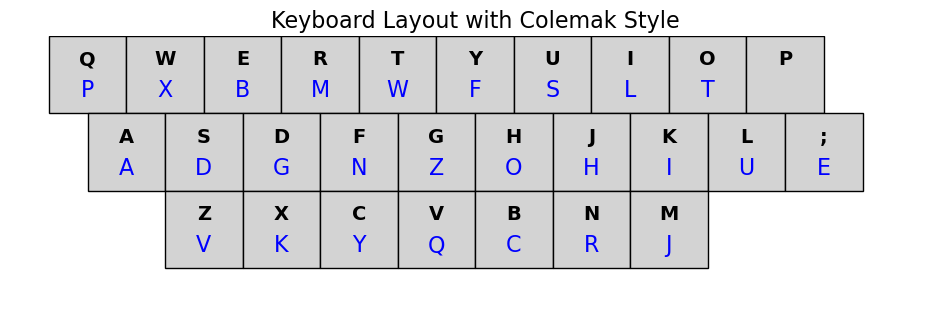
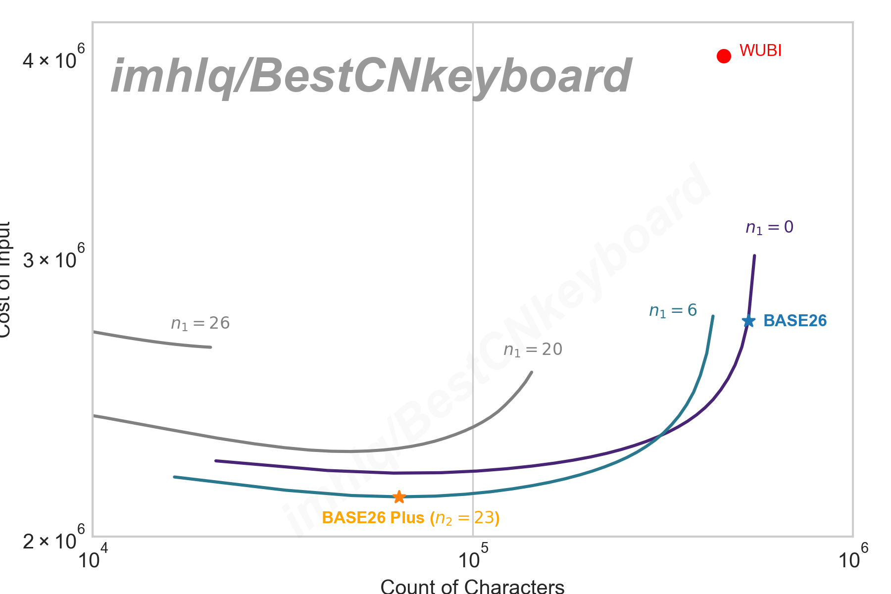

# BestCNkeyboard
寻找中文输入的最优解

## 目的
西式键盘布局是符合英文输入的非常有效的手段，因此，在实际使用中，外国人的输入速度异常的快。本项目并不用于实际商业用途，仅由于个人学习研究的兴趣，试着找出最符合中文输入情况的最优解。至于这个解到底好不好，有没有其他意义，利不利于英文输入，阻不阻碍国际交流，全不关心。

## 定义最优解

最优解意味着打同样的一段文字，手指移动的距离最短。其中手指的移动不仅仅是平面移动，也包括按键时的上下移动。因此，按一次按键优于同一个位置按两次按键。

中文输入的另一个关键问题在于输入方式，五笔，王码，拼音，双拼等基于字形、字音的输入层出不穷，何者更快显然长期以来是有争议的。中文常用汉字以8000算，为26\*3=17576字，显然，目前存在的所有汉字都可以用三个字母表示出来，但问题在于这种最直接的输入方式并不利于记忆，估计也没有人能够去记下这一万组没有意义的字母排列组合。最方便的莫过于拼音，不需要字形的记忆。而并驾齐驱的五笔字型由于四个字母的固定输入，使得速度上限很高。双拼的存在是由于简化按键布局的需要，其输入次数，键程距离相较拼音并无不同，反而多了混淆字问题。如此云云。因此最优解也存在着条件，或许一种从未出现的输入方式，可以经过一段时间的学习而超过拼音五笔。

综上所述，最优解分为两种类型，第一是特定输入方法下的键盘布局最优解，另一个是任意输入方法与键盘布局共同的（包含记忆成本）全局最优解。

## 特定方法最优解

### 仅更改标准键盘布局

下面方法不变更拼音输入法，不创造新按键，仅修改按键布局。

## 全局最优解

### BASE26

目前存在的所有汉字都可以用三个字母编码出来，当前QWERTY键盘输入对应表见 [26字母对应表](./base26_characters.csv)。

### BASE26 Plus

BASE26 面临的主要问题是输入法的停止词问题，即当该汉字仅一个编码时，仍需要按停止词（如空格键）进而增加按键数，因而不能达到最优解。
对于此问题，有一种改进办法，即在每次输入时，选取一定数量的按键作为停止词，即 **BASE26 Plus** 方案。

在第一次键入时，取`n1`个按键为停止词，也即当系统收到这些按键时，直接输出汉字而不等待下一个输入。
在第二次键入时，取`n2`个按键为停止词，以此类推，选取`n3`, `n4` ...

在总按键数为 27 个时 (26字母键+空格键)，最优解为`n1 = 6`, `n2 = 23`, `n3 = 1`，即第一次输入停止词数为**6个**，第二次输入停止词数为**23个**，第三次输入停止词数为**1个**。该方案下支持字数为 61641 字，平均每个字键入 2.12 次按键。

即第一次输入保留6个按键为停止词，比如`空格ABCDE`，对应汉字依概率分别为：

> 的，一，了，是，不，我

第二次输入时，保留23个按键为停止词，即当输入者第一次输入除`空格ABCDE`这6个停止词外后，第二次输入`空格ABCD...V`等23个按键都直接输入结果。对应可能结果为 `(27-6)*23 = 483` 个汉字。

上图为每百万字所需按键数

*注：上述计算基于25亿字语料汉字字频表，对于文言文等特定领域结论可能有变化。*

## 最终幻想

### 洛书·双鱼共振式输入接口

传统西方输入设备（如 QWERTY 键盘）基于“离散开关逻辑” (Discrete Switch Logic) 和“线性字符堆叠” (Linear Stacking)，将思维强制拆解为无意义的字母序列。这种设计在高维信息录入（如汉字、复杂指令集）时存在严重的效率折损与生理损伤（如腱鞘炎）。

“洛书·双鱼” (Luo-Shu Twin-Fish) 输入系统摒弃了机械按键，采用**“压感-场感混合架构”**。它遵循人体经络工学，以“和弦输入” (Chording) 为核心逻辑，将用户的输入行为从“击打” (Typing) 升维为 “谱写” (Composing)，实现了意念与机器的毫秒级同步。

物理形态：阴阳双鱼布局 (The Twin-Fish Layout)
设备主体并非单体平板，而是完全分离的左右两翼，呈流线型“逗号”状，模拟太极图中的阴阳鱼。

左翼（阴·体）： 负责定义数据的性质（如部首、五行属性、文件类型）。

右翼（阳·用）： 负责定义数据的形态（如声旁、笔势、执行动作）。

中央虚空（The Void）： 两翼之间无任何实体连接，形成宽约 15-30cm 的“虚空区”。此区域内置 LiDAR 场感矩阵，用于捕捉悬空手势。

传感器阵列：三维力觉 (3D Force Sensing)
每个键位并非单纯的开关 (On/Off)，而是深度传感器，支持 256 级压力感应。

轻触 (Tap)： 点选、轻声。

重按 (Press)： 确认、重音、强调。

揉搓 (Rub)： 修正、微调参数。

核心机制：音律和弦 (Resonance Chording)
不同于五笔输入法的“串行击键”（先按A，松开，再按B），本设备采用**“并行和弦”**。

操作： 左手与右手同时按下（或存在极短的时间差，类似钢琴的装饰音）。

实例： 输入汉字 “雷”。

左手： 按压“雨”区（天象属性）。

右手： 按压“田”区（地象/声旁）。

结果： 双手触底瞬间，字符上屏。无选词框，无延迟。

动态修饰：势 (Momentum)字符的最终形态由按键的轨迹与力度决定。场景： 输入指令 Print("Hello")。常规输入： 平稳按压 $\rightarrow$ 标准宋体/黑体显示。急促重击： 快速重按 $\rightarrow$ 屏幕显示的文字可能带有**“飞白”**（类似草书），且系统理解为“高优先级/紧急输出”。

虚空手势：无形之用 (Gestures in The Void)利用中央的 LiDAR 场感区，手离开键盘区域（悬腕）即可触发宏指令。挥（Swipe）： 翻页、切换窗口。合（Clap/Close）： 双手向中间合拢（不接触） $\rightarrow$ 保存并关闭文件（Save & Exit）。提（Lift）： 手掌上提 $\rightarrow$ 提取关键信息/调出搜索框。

键位映射图谱 (Mapping Spectrum)
为了适应不同的专业需求，键位支持动态重映射（通过墨水屏键帽显示）。

4.1 标准·文章模式 (Writer Mode)
内圈（五行）： 金（西）、木（东）、水（北）、火（南）、土（中）。用于定部首大类。

外圈（八卦）： 乾（天/健）、坤（地/顺）、震（雷/动）等。用于定声韵或抽象含义。

4.2 编程·算经模式 (Coder Mode)
左手： 定义对象 (Object) 与 类 (Class)。

右手： 定义方法 (Method) 与 运算 (Operation)。

力度： 轻按为定义变量，重按为执行函数。

5. 人体工学与健康 (Ergonomics & Health)
5.1 悬腕设计 (Floating Wrist)
传统键盘导致手腕压迫（腕管综合征）。双鱼布局强制用户保持**“悬腕”**姿态（类似弹古琴或写毛笔字）。

优势： 气血通畅，利用肩背大肌群发力，而非手指小肌群，极大地降低了疲劳感。

5.2 视线管理
中央的“虚空区”消除了视线遮挡，配合眼动追踪屏幕，实现了“手眼分离”但“意念合一”的操作流。

附录：快速上手口诀

左定性，右定形，
轻如水，重如金。
虚空挥，万象清，
双手合，天下平。

## 尾记

感兴趣合作者可联系。

## 数据来源

1. https://faculty.blcu.edu.cn/xinghb/zh_CN/article/167473/content/1437.htm （25亿字语料汉字字频表）
2. https://lingua.mtsu.edu/chinese-computing/statistics/index.html (汉字单字频率列表)
