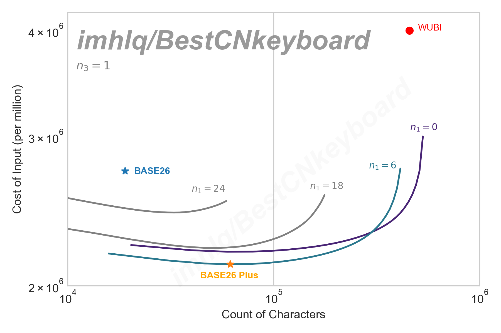

# BestCNkeyboard
寻找中文输入的最优解

## 目的
西式键盘布局是符合英文输入的非常有效的手段，因此，在实际使用中，外国人的输入速度异常的快。本项目并不用于实际商业用途，仅由于个人学习研究的兴趣，试着找出最符合中文输入情况的最优解。至于这个解到底好不好，有没有其他意义，利不利于英文输入，阻不阻碍国际交流，全不关心。

## 定义最优解

最优解意味着打同样的一段文字，手指移动的距离最短。其中手指的移动不仅仅是平面移动，也包括按键时的上下移动。因此，按一次按键优于同一个位置按两次按键。

中文输入的另一个关键问题在于输入方式，五笔，王码，拼音，双拼等基于字形、字音的输入层出不穷，何者更快显然长期以来是有争议的。中文常用汉字以8000算，为26\*3=17576字，显然，目前存在的所有汉字都可以用三个字母表示出来，但问题在于这种最直接的输入方式并不利于记忆，估计也没有人能够去记下这一万组没有意义的字母排列组合。最方便的莫过于拼音，不需要字形的记忆。而并驾齐驱的五笔字型由于四个字母的固定输入，使得速度上限很高。双拼的存在是由于简化按键布局的需要，其输入次数，键程距离相较拼音并无不同，反而多了混淆字问题。如此云云。因此最优解也存在着条件，或许一种从未出现的输入方式，可以经过一段时间的学习而超过拼音五笔。

综上所述，最优解分为两种类型，第一是特定输入方法下的键盘布局最优解，另一个是任意输入方法与键盘布局共同的（包含记忆成本）全局最优解。

## 特定方法最优解

### 仅更改标准键盘布局

下面方法不变更拼音输入法，不创造新按键，仅修改按键布局。

## 全局最优解

### BASE26

目前存在的所有汉字都可以用三个字母编码出来，当前QWERTY键盘输入对应表见 [26字母对应表](./base26_characters.csv)。

### BASE26 Plus

BASE26 面临的主要问题是输入法的停止词问题，即当该汉字仅一个编码时，仍需要按停止词（如空格键）进而增加按键数，因而不能达到最优解。
对于此问题，有一种改进办法，即在每次输入时，选取一定数量的按键作为停止词，即 **BASE26 Plus** 方案。

在第一次键入时，取`n1`个按键为停止词，也即当系统收到这些按键时，直接输出汉字而不等待下一个输入。
在第二次键入时，取`n2`个按键为停止词，以此类推，选取`n3`, `n4` ...

在总按键数为 27 个时 (26字母键+空格键)，最优解为`n1 = 6`, `n2 = 23`, `n3 = 0`，即第一次输入停止词数为**6个**，第二次输入停止词数为**23个**，第三次已覆盖全部汉字，无需停止词。该方案下支持字数为 63993 字，平均每个字键入 2.118 次按键。

即第一次输入保留6个按键为停止词，比如`空格ABCDE`，对应汉字依概率分别为：

> 的，一，了，是，不，我

第二次输入时，保留23个按键为停止词，即当输入者第一次输入除`空格ABCDE`这6个停止词外后，第二次输入`空格ABCD...V`等23个按键都直接输入结果。对应可能结果为 `(27-6)*23 = 483` 个汉字。

上图为每百万字所需按键数

*注：上述计算基于25亿字语料汉字字频表，对于文言文等特定领域结论可能有变化。*

## 尾记

感兴趣合作者可联系。

## 数据来源

1. https://faculty.blcu.edu.cn/xinghb/zh_CN/article/167473/content/1437.htm （25亿字语料汉字字频表）
2. https://lingua.mtsu.edu/chinese-computing/statistics/index.html (汉字单字频率列表)
